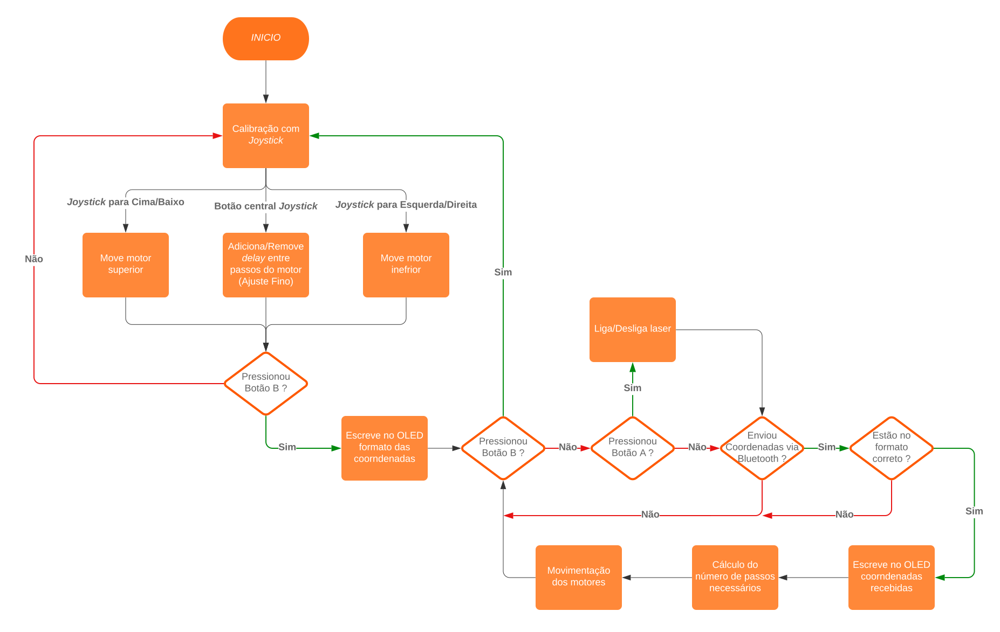
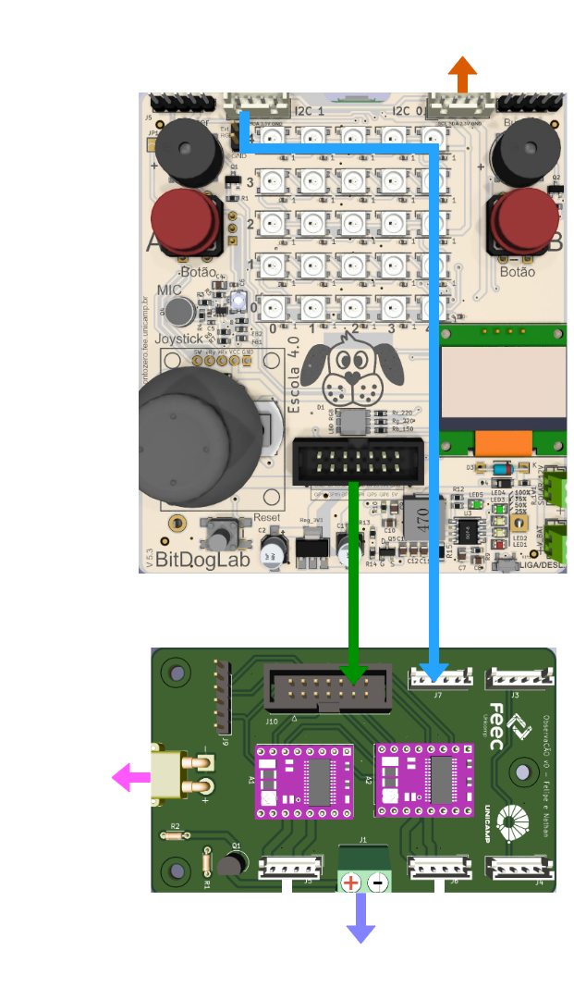
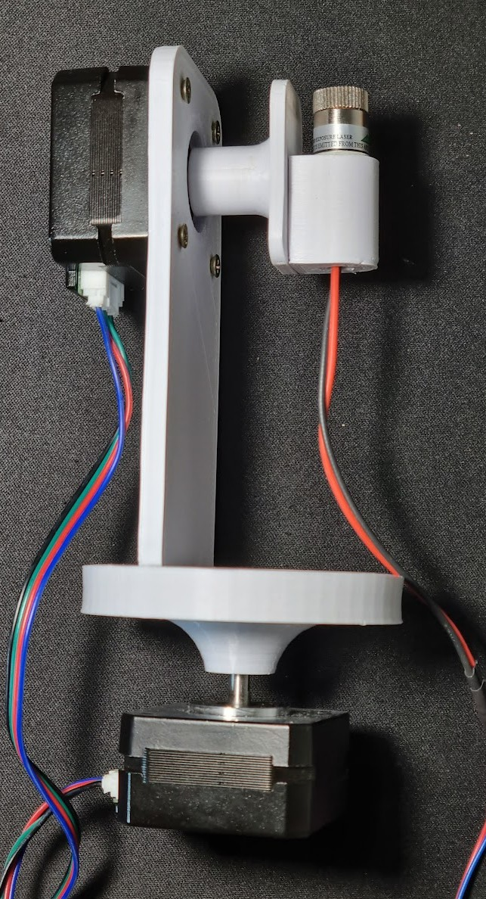
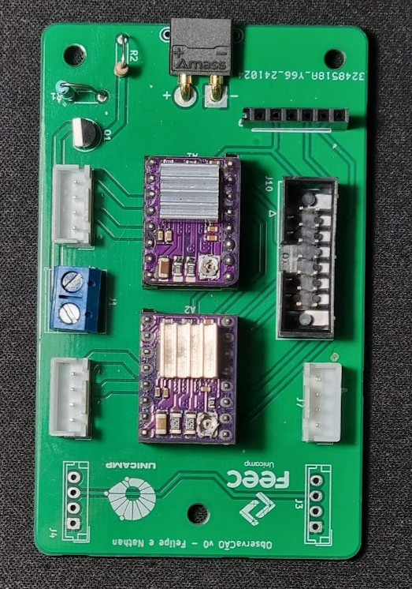
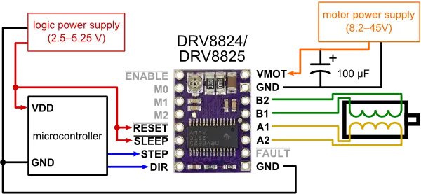
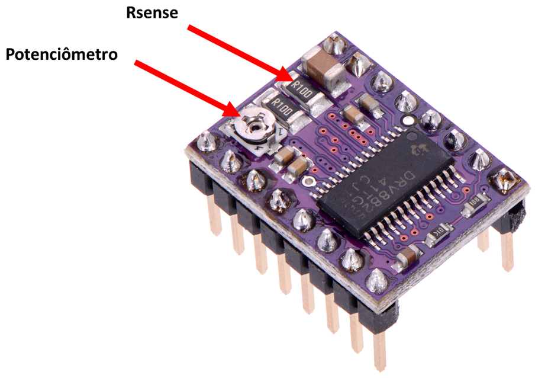

# `ObservaCÃO - um ajudante para observação do céu noturno` ([Manual de Uso aqui](https://github.com/shen-n/EA076_2S2024/blob/main/manual_de_uso.md))

Este trabalho trata-se do projeto final da disciplina *EA076 (Laboratório de Sistemas Embarcados)*, ministrada pelo Prof. Dr. Fabiano Fruett no segundo semestre de 2024. Ele foi baseado no trabalho "[_Star Track - Arduino Powered Star Pointer and Tracker_](https://www.instructables.com/Star-Track-Arduino-Powered-Star-Pointer-and-Tracke/)", de Görkem, sendo adaptado para operar com a placa BitDogLab.

|Nome do aluno  | RA | Curso|
|--|--|--|
| Felipe Hiroshi Kano Inazumi | 215696  | Eng. Elétrica|
| Nathan Shen Baldon  | 242448 | Eng. Elétrica|

## Descrição do Projeto

O projeto buscou a construção de um sistema capaz de apontar para corpos celestes com um laser, independente da posição do observador. Para isso, deve-se fornecer ao dispositivo as coordenadas do corpo celeste que se deseja observar. Um dos requisitos foi de que o dispositivo construído fosse _wireless_, ou seja, independente de cabos para alimentação e comunicação, para que pudesse ser usado em campo com maior facilidade. 

Potenciais usuários:
- amantes de astronomia e astrofotografia;
- educadores;

## Metodologia

O desenvolvimento deste projeto envolveu quatro frentes: (a) estudo teórico sobre localização de corpos celestes (resumido no sistemas de coordenadas escolhido); (b) escolha de materiais; (c) desenvolvimento e fabricação de uma estrutura mecânica; (d) desenvolvimento e fabricação de uma PCB; (e) desenvolvimento do programa. 

### Sistemas de coordenadas

Optou-se por utilizar coordenadas do Sistema Horizontal neste projeto, ou seja, são usados os valores de Azimute e Altitude para localização de cada corpo celeste. O seguinte _site_ foi usado para determinação das coordenadas: [base de dados de corpos celestes](https://www.timeanddate.com/astronomy/night/). Mais detalhes sobre sistemas de coordenadas são fornecidos no **Apêndice A**.

### Materiais Utilizados

Os materiais escolhidos e utilizados são descritos na tabela a seguir. Se desejado, pode-se clicar no nome do material para ser redirecionado para o site de um fornecedor.

|Materiais | Qtde. | Descrição |
|--|--|--|
| [Placa BitDogLab](https://github.com/BitDogLab/BitDogLab/tree/main) | 1 | Controle do projeto. Além disso, os botões e joystick da placa também foram utilizados para controle pelo usuário. |
| [Motor de Passo 17HS4023](https://pt.aliexpress.com/item/1005007232266402.html?src=google&src=google&albch=shopping&acnt=768-202-3196&isdl=y&slnk=&plac=&mtctp=&albbt=Google_7_shopping&aff_platform=google&aff_short_key=UneMJZVf&gclsrc=aw.ds&&albagn=888888&&ds_e_adid=&ds_e_matchtype=&ds_e_device=c&ds_e_network=x&ds_e_product_group_id=&ds_e_product_id=pt1005007232266402&ds_e_product_merchant_id=107776500&ds_e_product_country=BR&ds_e_product_language=pt&ds_e_product_channel=online&ds_e_product_store_id=&ds_url_v=2&albcp=21451844582&albag=&isSmbAutoCall=false&needSmbHouyi=false&gad_source=1&gclid=CjwKCAjwufq2BhAmEiwAnZqw8ryQpUhfJJZnJBBU1dzkV41koB3Xd2dV5Wr7NiGT26p2H47F2nBP8BoCk3AQAvD_BwE#nav-description) | 2 | Para movimentar o laser. |
| [Driver DRV8825](https://pt.aliexpress.com/item/4000083334758.html?spm=a2g0o.productlist.main.1.1ee63b5dYR0HFh&algo_pvid=f9678024-8e61-435d-b24b-e7b03aa366c1&algo_exp_id=f9678024-8e61-435d-b24b-e7b03aa366c1-0&pdp_npi=4%40dis%21BRL%219.17%219.17%21%21%211.55%211.55%21%402101fb0b17259175411665778e296c%2110000000221353262%21sea%21BR%21820637743%21X&curPageLogUid=1fFYR8MPnuXO&utparam-url=scene%3Asearch%7Cquery_from%3A) | 2 | Para realizar a interface entre BitDogLab e motores. Este driver utiliza a interface STEP/DIR, que facilita o controle dos motores, sendo necessários apenas 2 pinos na BitDogLab (mais detalhes no **Apêndice B**). |
| [Bateria 3S](https://pt.aliexpress.com/item/1005003835491136.html?spm=a2g0o.productlist.main.1.35611c4axpUbnB&algo_pvid=e869b7f9-aebd-43ff-8cf8-b699134a31af&algo_exp_id=e869b7f9-aebd-43ff-8cf8-b699134a31af-0&pdp_npi=4%40dis%21BRL%21335.05%21184.30%21%21%2152.54%2128.90%21%402103237317330016817741462e31ea%2112000038628969519%21sea%21BR%21820637743%21X&curPageLogUid=6e8nIrLFmuko&utparam-url=scene%3Asearch%7Cquery_from%3A) | 1 | Para que o ObservaCÃO seja independente da rede elétrica. |
| [Laser](https://pt.aliexpress.com/item/1005006719063413.html?spm=a2g0o.productlist.main.47.5b528DSC8DSCZL&algo_pvid=fd9bea5f-df14-442b-9f88-218b0c320ad9&aem_p4p_detail=202411301313296697071011177370001865716&algo_exp_id=fd9bea5f-df14-442b-9f88-218b0c320ad9-23&pdp_npi=4%40dis%21BRL%2121.87%2120.34%21%21%213.43%213.19%21%402103201917330012093146250ef29e%2112000038085388176%21sea%21BR%21820637743%21X&curPageLogUid=5TyeX89aGz4e&utparam-url=scene%3Asearch%7Cquery_from%3A&search_p4p_id=202411301313296697071011177370001865716_6) | 1 | Para apontar para os corpos celestes. |
| [Módulo Bluetooth HC-05](https://www.eletrogate.com/modulo-bluetooth-rs232-hc-05?utm_source=Site&utm_medium=GoogleMerchant&utm_campaign=GoogleMerchant&utm_source=google&utm_medium=cpc&utm_campaign=[MC4]_[G]_[PMax]_Categorias&utm_content=&utm_term=&gad_source=1&gclid=CjwKCAiAjKu6BhAMEiwAx4UsAqtbrS_S_TdBN0OxV5r_2TgRlhCnLvffXhJ7JxJXbR2puQFTbAGGFxoC9gUQAvD_BwE) | 1 | Para que as coordenadas dos corpos celestes fossem passadas para a BitDogLab sem necessidade de fios. |
| [Parafusos M3 10 mm](https://pt.aliexpress.com/item/1005007219475077.html?spm=a2g0o.productlist.main.21.6a963d1dzLJ7hc&algo_pvid=9d594b07-ea1f-4dd6-a3d9-85259d659b2e&algo_exp_id=9d594b07-ea1f-4dd6-a3d9-85259d659b2e-10&pdp_npi=4%40dis%21BRL%218.16%218.16%21%21%211.28%211.28%21%402103010e17330013153847143ee080%2112000039933522857%21sea%21BR%21820637743%21X&curPageLogUid=s4zueP23lyjy&utparam-url=scene%3Asearch%7Cquery_from%3A) | 4 | Para montagem de um dos motores de passo na estrutura mecânica. |
| [Conector XT30pw fêmea 90 graus](https://pt.aliexpress.com/item/1005004957495676.html?spm=a2g0o.productlist.main.19.3151uBL9uBL9SF&algo_pvid=02c4525d-b678-4c0e-b519-59ae541b0730&algo_exp_id=02c4525d-b678-4c0e-b519-59ae541b0730-9&pdp_npi=4%40dis%21BRL%211.66%211.66%21%21%210.26%210.26%21%402103247917330014227191664ed1a2%2112000031154779399%21sea%21BR%21820637743%21X&curPageLogUid=xKBgxkLjv4B9&utparam-url=scene%3Asearch%7Cquery_from%3A) | 1 | Para conexão da bateria na PCB criada. |
| [Cabo com conector JST 4 pinos](https://www.makerhero.com/produto/conector-jst-4-pinos-femea/?gad_source=1&gclid=CjwKCAiAjKu6BhAMEiwAx4UsAl4_gJ-5PNdV9rmTd0kF7blvSqFHF_JUx8ye31I1oftJEZEbPSfr_xoC_MgQAvD_BwE) | 4 | Para conexão entre a BitDogLab e a PCB desenvolvida. |
| [Conector JST 4 pinos macho (I2C)](https://www.makerhero.com/produto/conector-jst-4-pinos-macho/) | 3 | Utilizados na PCB criada para conexão com a BitDogLab. |
| [Conector IDC Box 14 pinos macho](https://pt.aliexpress.com/item/1005006804603387.html?spm=a2g0o.productlist.main.13.2c401d35aEuDLu&algo_pvid=dce204da-6e38-47c0-a5cd-3767e274d56a&algo_exp_id=dce204da-6e38-47c0-a5cd-3767e274d56a-6&pdp_npi=4%40dis%21BRL%2124.45%217.83%21%21%2127.78%218.89%21%402101ef7017330015717997979e2204%2112000038361940664%21sea%21BR%21820637743%21X&curPageLogUid=l8cuuroPD1VO&utparam-url=scene%3Asearch%7Cquery_from%3A) | 1 | Utilizado na PCB criada para conexão com a BitDogLab. |
| [Cabo flat com conector IDC Box 14 pinos](https://pt.aliexpress.com/item/1005003161799870.html?spm=a2g0o.productlist.main.5.794a6cb4IXeVPj&algo_pvid=c761506e-c609-41e1-ae3f-59f78ccbfad8&algo_exp_id=c761506e-c609-41e1-ae3f-59f78ccbfad8-2&pdp_npi=4%40dis%21BRL%2128.06%218.16%21%21%214.40%211.28%21%402103237317330016535638644e31ea%2112000024427578485%21sea%21BR%21820637743%21X&curPageLogUid=HS1RQDKcrUE4&utparam-url=scene%3Asearch%7Cquery_from%3A) | 1 | Para conexão entre a BitDogLab e a PCB desenvolvida. |

### Estrutura Mecânica

Para integrar os motores e o laser, foi desenvolvida uma estrutura mecânica, composta de quatro partes. Elas foram desenvolvidas no _software_ AutoCad Inventor e estão na pasta [3d_models](https://github.com/shen-n/EA076_2S2024/tree/main/3d_models). As peças foram fabricadas em uma impressora 3D, utilizando filamento PLA na cor branca. A montagem foi feita conforme o arquivo [assembly.stl](https://github.com/shen-n/EA076_2S2024/blob/main/3d_models/assembly.stl). O motor da base é utilizado para determinar a coordenada Azimute e, o motor superior, para a coordenada Altitude. Assim, ao longo da documentação, são muitas vezes chamados de motores de passo Azimute e Altitude. 

### Desenvolvimento da PCB


### Desenvolvimento do programa 

O programa utilizado neste projeto foi desenvolvido na linguagem de programação micropython e utiliza as seguintes bibliotecas:
- Machine
- Time
- Sys
- Ssd1306
- Framebuf
A comunicação com o módulo bluethooh foi feita via protocolo UART, e mais especificamente foi utilizada a UART0 da Raspiberry neste projeto. 

O programa inicia com uma função de calibração controlada via Joystick da BitDogLab, de tal forma que, o usuário deverá utilizar movimentos do joystick para cima/baixo ou para a esquerda/direita para controlar os motores superiores e inferiores de tal forma a alinhar o laser na posição horizontal e na direção do polo norte.

Cada comando direcional do Joystick envia o comando de 1 passo para o respectivo motor (superior ou inferior). Quando o usuário pressiona o botão central do Joystick, um delay é adicionado entre cada comando de 1 passo para o motor, resultando em um movimento mais sensível e permitindo assim uma calibração fina dos motores. Esse pressionar do botão do Joystick alterna entre os modos de calibração fina e mais rápida. Para confirmar a calibração estabelecida, o usuário deve pressionar o botão B para avançar para a próxima etapa do programa. Neste momento, o programa entende que a posição atual dos motores é a referência (0,0).

Em seguida, o programa aguarda o envio das coordenadas, via módulo bluetooth, do astro a ser apontado. As coordenadas devem ser enviadas no formato:

````
Azimuth,Altitude 
````

Note que estas coordenadas podem ser do tipo float com precisão de 2 casas decimais, e não deve haver espaço entre virgulas. Ambos as coordenadas podem ser valores negativos e caso o valor azimutal seja maior que 180°, o programa converte este valor de ângulo positivo para o respectivo ângulo negativo para evitar que o motor inferior rotacione mais do que o necessário.

Por fim, o programa calcula o número de passos necessários para cada motor para rotacionar a estrutura no ângulo informado pelo usuário.

Entre cada envio das coordenadas, o usuário também pode pressionar o Botão A ou Botão B da BitDogLab e uma das situações a seguir deve ocorrer:
- Botão A: Alterna o estado do Laser para Ligado/Desligado
- Botão B: O programa entra no modo de calibração conforme mencionado anteriormente, sendo necessário pressionar novamente o botão B para concluir a calibração. 


Abaixo é apresentado um fluxograma do programa descrito

- **Fluxograma:**



## Descrição Estrutural

Para que se compreenda a conexão entre os diferentes componentes, foi criada a tabela abaixo, que apresenta qual GPIO da BitDogLab foi atribuída a cada pino de cada periférico. Além disso, na coluna mais à direita, é apresentado em qual conector cada GPIO se situa.

Obs: note que os pinos de ajuste de micropasso dos dois _drivers_ (M0, M1 e M2) estão conectados entre si, não sendo possível configurá-los de forma independente.

### Conexões com BitDogLab
<table><thead><tr><th></th><th>Pino</th><th>GPIO</th><th>Conector BitDogLab</th></tr></thead><tbody><tr><td rowspan="5">Driver 1 (motor Altitude)</td><td>M0</td><td>19</td><td rowspan="10">IDC box 14 pinos</td></tr><tr><td>M1</td><td>20</td></tr><tr><td>M2</td><td>18</td></tr><tr><td>DIR</td><td>4</td></tr><tr><td>STEP</td><td>28</td></tr><tr><td rowspan="5">Driver 2 (motor Azimute)</td><td>M0</td><td>19</td></tr><tr><td>M1</td><td>20</td></tr><tr><td>M2</td><td>18</td></tr><tr><td>DIR</td><td>17</td></tr><tr><td>STEP</td><td>16</td></tr><tr><td>Laser</td><td>-</td><td>2 (SDL)</td><td>I2C1</td></tr><tr><td rowspan="4">Módulo Bluetooth HC-05</td><td>RX</td><td>0 (SDA)</td><td rowspan="4">I2C0</td></tr><tr><td>TX</td><td>1 (SCL)</td></tr><tr><td>VCC</td><td>3V3</td></tr><tr><td>GND</td><td>GND</td></tr></tbody></table>

Também, para facilitar a montagem, a figura abaixo mostra quais conexões devem ser feitas entre a BitDogLab e todos os periféricos.



## Resultados

A figura abaixo apresenta o resultado da montagem da estrutura mecânica. Como pode se constatar, ficou exatamente conforme o modelo 3D projetado.



A montagem da PCB também foi um sucesso, sendo apresentada abaixo.



Em relação ao funcionamento do dispositivo para observação do céu, não foi possível visualizar o _laser_ durante a noite (muito fraco), sendo que não foi possível analisar sua precisão. No entanto, foram utilizados aplicativos de celular que localizam corpos celestes (e.g. [Star Walk 2](https://play.google.com/store/apps/details?id=com.vitotechnology.StarWalk2Free&hl=pt_BR)) e, em testes, o sistema ObservaCÃO apontou aproximadamente para a mesma direção indicada pelos aplicativos, mostrando potencial. No entanto, havia sempre algum erro entre o celular e o dispositivo, principalmente pela calibração falha em **ambos** os dispositivos, o que será discutido na próxima seção.  

## Desafios e Conclusão

Ao longo do desenvolvimento do projeto, houve apenas desafios pequenos. Primeiramente, pode-se citar o mau funcionamento das GPIOs 8 e 9 (UART1), que seriam usadas com o módulo bluetooth HC-05. Em nenhum momento, foi possível ler ou escrever dados com estes pinos, mesmo realizando a atribuição explícita deles para UART1 no programa. Assim, foi necessário utilizar a UART0 (GPIOs 0 e 1), a qual funcionou. No tempo do projeto, não foi possível identificar o problema com a UART1. Vale comentar também que o módulo bluetooth apresentou inconsistências, ora lendo e escrevendo corretamente, ora não.

Outro problema encontrado ao longo do desenvolvimento do projeto foram falhas em fios/cabos: um deles foi um _jumper_ de _protoboard_, o qual estava rompido internamente; outro foi com a crimpagem do cabo flat utilizado, que apresentou falhas de continuidade e precisou ser ajustado.

Por fim, o desafio mais relevante foi aquele relacionado com erros na indicação de corpos celestes. Uma das grandes fontes de erro foi a calibração do celular, que estava sendo usado como referência de bússola e como referência da localização dos corpos celestes. Note que, neste caso, qualquer erro nesta referência causa erros no dispositivo ObservaCÃO e a própria indicação dos astros dada pelo celular pode estar também equivocada. Para corrigir isso, poderia ter sido utilizado o Sistema Equatorial (descrito no **Apêndice A**) e alguma estrela conhecida como referência, o que eliminaria, ao menos, uma fonte de erro. A dificuldade de se usar este sistema, entretanto, foi de que toda a estrutura mecânica teria de ser alinhada com o plano fundamental desse sistema, o que não foi possível neste projeto, mas que poderia ser considerado em uma próxima versão do dispositivo.

Assim, encerra-se indicando possíveis melhorias futuras: (a) melhorar estabilidade da estrutura mecânica, a qual atualmente tomba durante movimentos bruscos dos motores; (b) adicionar peça para acoplamento do dispositivo ObservaCÃO com tripé, o que permitiria incliná-lo e alinhá-lo com o plano fundamental do Sistema Equatorial; (c) adicionar conexão entre pinos ENABLE dos drivers e BitDogLab, para que seja possível ativar e desativar os motores quando desejado, o que aumentaria a autonomia da bateria.

## Referências

[1] GörkemPortfolio, “Star Track - Arduino Powered Star Pointer and Tracker,” Instructables. https://www.instructables.com/Star-Track-Arduino-Powered-Star-Pointer-and-Tracke/

[2] “Coordinate Systems Comparison,” Unl.edu, 2024. https://astro.unl.edu/classaction/animations/coordsmotion/celhorcomp.html.

[3] “Galileo’s Finger - an Open Source Astronomy Learning Tool,” Instructables, Mar. 30, 2015. https://www.instructables.com/Galileos-Finger-An-Open-Source-Astronomy-Learning-/.

[4] P. Dyches, “What is the North Star and How Do You Find It? - NASA Science,” science.nasa.gov, Jul. 28, 2021. https://science.nasa.gov/solar-system/skywatching/what-is-the-north-star-and-how-do-you-find-it/

[5] “The North Star: Polaris,” Space.com, May 16, 2017. https://www.space.com/15567-north-star-polaris.html

[6] “Horizontal and equatorial coordinate systems,” Astronomy Stack Exchange, Dec. 31, 2021. https://astronomy.stackexchange.com/questions/48004/horizontal-.

[7] “Sistema horizontal de coordenadas,” Wikipedia.org, Jul. 2007. https://pt.wikipedia.org/wiki/Sistema_horizontal_de_coordenadas.

[8] “The Internet Stellar Database,”. http://www.stellar-database.com/

## Apêndice A - sistemas de coordenadas

Para localizar corpos celestes, é muito comum que se utilize o sistema de coordenadas celeste. Nele, usa-se o conceito de Esfera Celeste: uma projeção de todo o céu em uma esfera de raio indeterminado e concêntrica à Terra (como se o céu que vemos fosse uma casca esférica ao redor da Terra). A localização dos corpos se dá através de coordenadas esféricas, as quais dependem do plano fundamental escolhido (plano que divide Esfera Celeste em dois hemisférios) [1]. O Sistema Horizontal, por exemplo, é geralmente mais conhecido (com Azimute/Altitude como coordenadas) e utiliza o horizonte local do observador como plano fundamental [1,7]. O problema é que, como a referência (plano fundamental) depende da posição do observador na Terra, a posição do corpo celeste a ser apontado, por consequência, também depende. Assim, para eliminar essa dependência, é comum que se utilize o Sistema Equatorial, que toma como plano fundamental o Equador Celeste (projeção da Linha do Equador na Esfera Celeste) [1,6]. O Polo Norte e Polo Sul também são projetados na Esfera Celeste, sendo denominados Polo Sul Celeste e Polo Norte Celeste.

As coordenadas são dadas em Ascenção Reta e Declinação:
- Declinação (DEC): ângulo entre Equador Celeste e Polos Norte ou Sul Celestes (varia de -90 a 90°).
- Ascensão Reta (RA): ângulo ao longo do Equador Celeste em relação a uma referência zero (ponto vernal - equivalente ao Meridiano de Greenwich como referência de longitude). Ele é dado em horas, minutos e segundos, de forma que uma volta completa equivale a 24h.

Assim, para localizar os corpos celestes, pode-se utilizar uma base de dados que indique as coordenadas no Sistema Equatorial [1,8]. Também, o sistema precisa saber onde estão as referências de posição necessárias:
- Referência para DEC: uma alternativa é encontrar o Polo Norte Celeste, que pode ser encontrado através da Estrela Polar (Polaris) [1,4,5]. Assim, seria necessário apontar para esta Estrela manualmente, indicando para o sistema sua posição (obs: esta estrela é visível apenas no hemisfério Norte, sendo necessário outra referência para observadores do hemisfério Sul).
- Referência para RA: pode-se utilizar o tempo sideral, que também tem como referência o ponto vernal (referência de RA). O tempo sideral pode ser calculado a partir do horário local. [1]

## Apêndice B - driver DRV8825

O driver DRV8825 possui duas pontes H e é projetado para controle de motores de passo bipolares. O controle é feito com a interface STEP/DIR, entradas que indicam quantos passos devem ser dados (definido pelo número de pulsos em STEP) e em qual direção (definido pelo nível lógico em DIR) (figura abaixo). 


Retirado de: [fonte](https://www.marinostore.com/automacao/driver-motor-de-passo-drv8825)

Para controle do tamanho do passo (microstep), é necessário introduzir uma combinação de valores binários nas entradas M0, M1 e M2, conforme apresentado na tabela abaixo. O driver possui uma resistência de pulldown interna, de tal forma que, se a entrada estiver desconectada o nível de tensão neste terminal está em 0V (GND).

<table><thead><tr><th>M2</th><th>M1</th><th>M0</th><th>Tamanho do Passo</th></tr></thead><tbody><tr><td>0</td><td>0</td><td>0</td><td>Passo completo</td></tr><tr><td>0</td><td>0</td><td>1</td><td>1/2 Passo</td></tr><tr><td>0</td><td>1</td><td>0</td><td>1/4 Passo</td></tr><tr><td>0</td><td>1</td><td>1</td><td>1/8 Passo</td></tr><tr><td>1</td><td>0</td><td>0</td><td>1/16 Passo</td></tr><tr><td>1</td><td>0</td><td>1</td><td rowspan="3"><br><br>1/32 Passo</td></tr><tr><td>1</td><td>1</td><td>0</td></tr><tr><td>1</td><td>1</td><td>1</td></tr></tbody></table>

Outra etapa necessária para o funcionamento do driver DRV8825 é a calibração da corrente de saída do driver. Esta calibração é feita alterando a posição do potenciômetro disponível no próprio driver, e fazendo a medição do valor de tensão entre este ponto e o GND. 



Com este valor de tensão, a corrente de saída do driver é calculada pela seguinte equação:

$$I_{OUT}= \dfrac{V_{Ref}}{Av \cdot R_{sense}}$$

Onde Vref é o valor da tensão medida no potênciometro, Av = 5 para este driver e o Rsense pode ser encontrado no driver conforme apresentado na figura acima.

